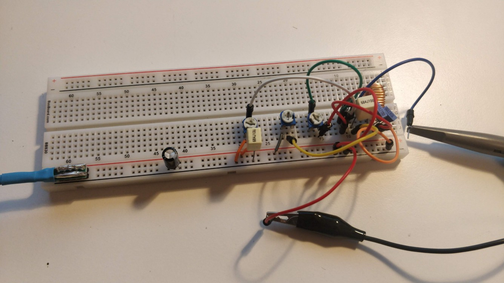

# HIGH-FREQUENCY-RF-SIGNAL-GENERATOR-USING-DISCRETE-COLPITTS-OSCILLATOR
This project demonstrates a high-frequency RF signal generator using a BJT-based circuit, validated through LTspice simulation and hardware implementation. The design explores gain, frequency response, and real-world effects, highlighting practical analog design and high-frequency behavior.
# High-Frequency RF Signal Generator Using Discrete Colpitts Oscillator

## OVERVIEW

This project demonstrates a high-frequency RF signal generator using a BJT-based circuit, validated through LTspice simulation and hardware implementation.

## SIMULATION
The circuit was modeled in LTspice as a common-emitter amplifier to evaluate its frequency response and high-frequency limitations.

* Wideband gain observed in MHz range

* Frequency roll-off due to parasitic capacitances

* Stable biasing ensures proper transistor operationThe circuit was analyzed in LTspice to study frequency response and gain behavior in the MHz range.

## HARDWARE IMPLEMENTATION

The circuit was implemented on a breadboard using a BC547 transistor and passive components.

Key considerations:

* Short wiring to minimize parasitic effects

* Proper grounding for noise reduction

* Stable biasing for consistent operation

## RESULTS

* Verified frequency response in simulation
* Stable waveform observed in hardware
* Demonstrates high-frequency operation

## SIMULATION NETLIST

```spice
VCC Vcc 0 DC 9
Vin in 0 AC 1 SIN(0 10m 1Meg)

R1 Vcc base 100k
R2 base 0 10k

Q1 collector base emitter BC547

RC Vcc collector 1k
RE emitter 0 220

Cin in base 10n
Cout collector out 10n

RL out 0 10k
CE emitter 0 10u

.model BC547 NPN(IS=1e-14 BF=200)

.ac dec 100 1k 100Meg
.tran 0 10u

.end
```

## IMAGES

### SIMULATION
<p align="center">
  
</p>

### HARDWARE

<p align="center">
  
</p>

# CHALLEGNES AND INSIGHTS

* High-frequency performance limited by parasitic capacitances

* Breadboard introduces noise and instability

* Real-world results differ from ideal simulation

# FUTURE IMPROVEMENTS

* Convert to true Colpitts oscillator for continuous RF generation

* Add buffer stage for impedance matching

* Design PCB for improved high-frequency stability

# KEY TAKEAWAY

This project highlights the transition from simulation to hardware, emphasizing practical RF design challenges and real-world analog behavior in high-frequency systems.
